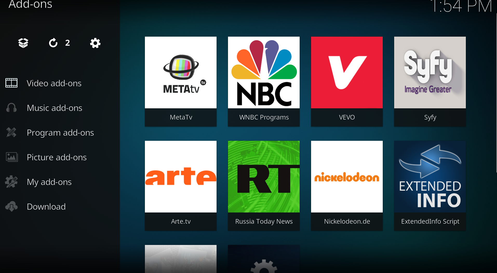
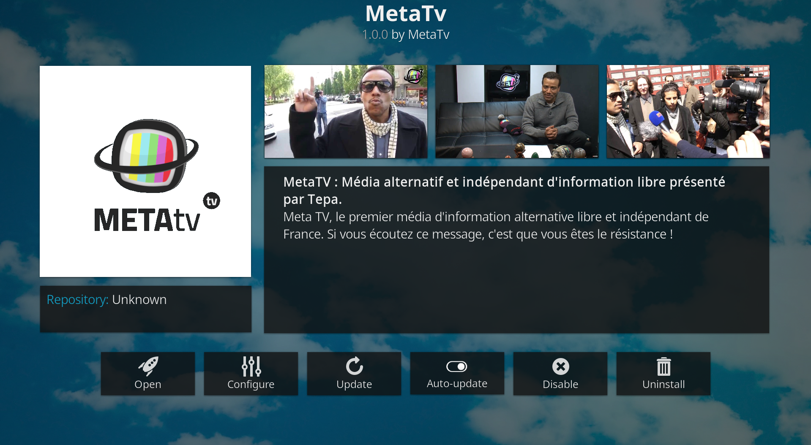

# Metatv
lecteur MetaTV Kodi  non officiel
Lecteur non officiel MetaTv pour le media center KODI
permet de suivre en direct le live metatv depuis l'application KODI
testé sur Windows seulement . 

INSTRUCTION : 
- Telecharger l'archive	plugin.video.metatv.zip  . 
   ou archiver  plugin.video.metatv aux format .zip

- le mode d'installation depuis kodi change suivant les versions . voir sur internet.
